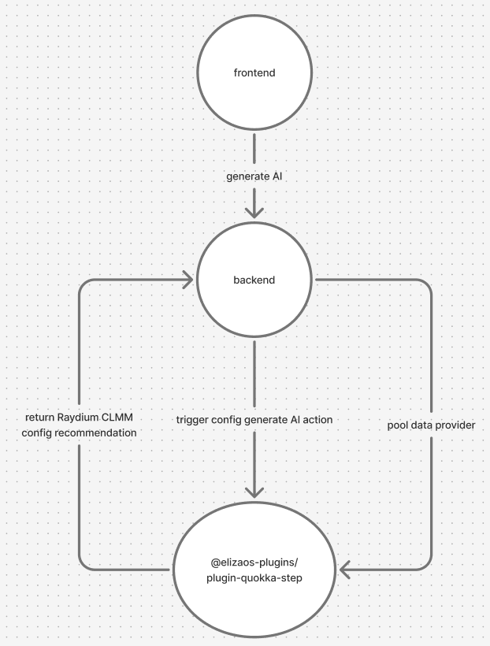

# @elizaos-plugins/plugin-quokka-step

quokka-step take part the Solana breakout hackthon defi track
and external track(https://earn.superteam.fun/listing/nibbles-global-side-track/)

## Overview

The plugin acts as an external server for the backend, mainly for the AI recommendation feature. When users click the AI configuration generation button, the plugin generates a configuration for increasing liquidity in the Raydium CLMM pool. This configuration is based on the pool's current metrics (such as liquidity and 24H volume) and the token amount in the user's wallet.

